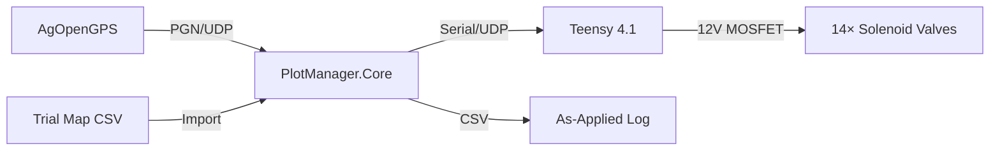

# Architecture Overview

## System Components



## Communication Protocol

### PlotManager ↔ Teensy (Serial)

Packet format: `[0xAA] [0x55] [CMD] [DATA...] [CRC]`

| Direction | Command | CMD Byte | Payload | Description |
|-----------|---------|----------|---------|-------------|
| PM → T | SET_VALVES | 0x01 | 2 bytes (mask) | Set 14-bit valve mask |
| PM → T | PRIME | 0x02 | 4 bytes (mask + duration) | Prime/flush sections |
| PM → T | HEARTBEAT | 0x03 | none | Keepalive |
| PM → T | E-STOP | 0x04 | none | Emergency shutdown |
| T → PM | STATUS | 0x80 | 3 bytes (mask + errors) | Current state report |
| T → PM | ACK | 0x81 | 1 byte (acked cmd) | Command acknowledgement |

CRC = XOR of all bytes from CMD through end of DATA.

### Safety Interlocks

1. **Heartbeat Timeout**: If Teensy doesn't receive heartbeat for 2 seconds → all valves close
2. **Speed Interlock**: Valves lock if speed deviates >±5% from target
3. **Emergency Stop**: Instant all-valves-close on command or software trigger
4. **Buffer Zone Lockout**: All valves forced closed when in buffer paths

## Hardware Wiring

### Teensy 4.1 → D4184 MOSFET → Gevax 1961

```
Teensy Pin N ──── D4184 Signal
                  D4184 VCC ──── 12V Supply (+)
                  D4184 OUT ──── Solenoid Terminal 1
                                 Solenoid Terminal 2 ──── 12V Supply (+)
                  D4184 GND ──── 12V Supply (-)

Flyback diode (SR560/1N5822) across solenoid terminals
(cathode to +12V side)
```

### Pin Mapping

| Teensy Pin | Section | Description |
|-----------|---------|-------------|
| 2 | 0 | Boom section 1 |
| 3 | 1 | Boom section 2 |
| 4 | 2 | Boom section 3 |
| 5 | 3 | Boom section 4 |
| 6 | 4 | Boom section 5 |
| 7 | 5 | Boom section 6 |
| 8 | 6 | Boom section 7 |
| 9 | 7 | Boom section 8 |
| 10 | 8 | Boom section 9 |
| 11 | 9 | Boom section 10 |
| 12 | 10 | Boom section 11 |
| 24 | 11 | Boom section 12 |
| 25 | 12 | Boom section 13 |
| 26 | 13 | Boom section 14 |
| 13 | — | Status LED |
